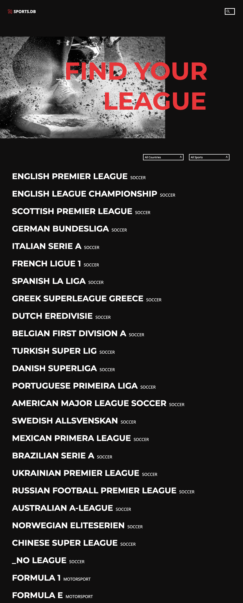
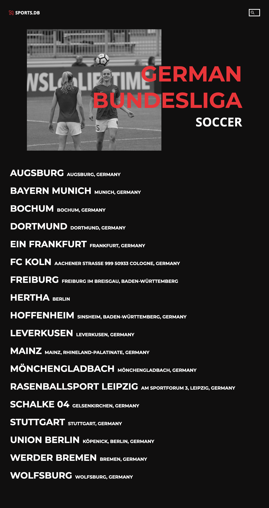
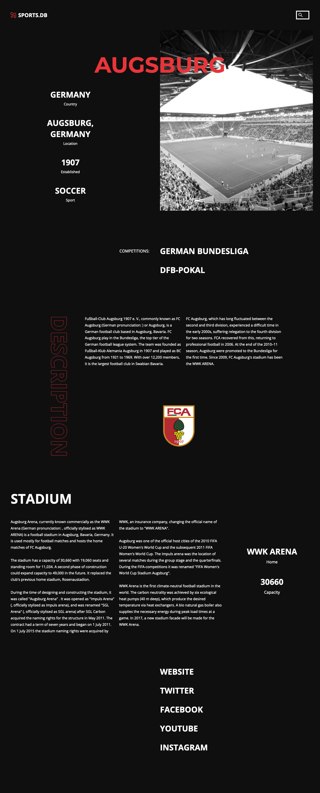

# super(c)ode Final Project - Sports.DB with TheSportsDB API

With this app you can find out about all the sports leagues that you can think of! Whether in golf, football, basketball - here you will find all information about teams, stadions and competitions. This app was set up with react.js and uses the data from [TheSportsDB API](https://www.thesportsdb.com/api.php).

## Table of contents

- [Overview](#overview)
  - [The challenge](#the-challenge)
  - [Screenshots](#screenshots)
  - [Links](#links)
- [My process](#my-process)
  - [Built with](#built-with)
  - [Useful resources](#useful-resources)
- [Authors](#authors)
- [Acknowledgments](#acknowledgments)

## Overview

### The challenge

The overall view of the leagues should be able to be filtered by country and sport. Users can use a search function to find specific information. Clicking on a league takes you to a subpage listing all the clubs (playing in that league). From here you can click on the club and call up a detail page with information about the club.

Users should be able to:

- View the optimal layout for the component depending on their device's screen size
- See hover states for all interactive elements on the page

### Screenshots

#### Home Screen with all leagues

#### League Screen with all Teams

#### Team Screen with all Details

### Links

- Solution URL: [https://github.com/reis-daniel/sports-db](https://github.com/reis-daniel/sports-db)
- Live Site URL: [https://supercodes-sportsdb.netlify.app/](https://supercodes-sportsdb.netlify.app/)

## My process

### Built with

- Semantic HTML5 markup
- SCSS
- CSS Flexbox
- [React](https://reactjs.org/) - JS library
  - [nodes sass](https://www.npmjs.com/package/node-sass)
    - [react-router-dom](https://www.npmjs.com/package/react-router-dom)
  - [axios](https://www.npmjs.com/package/axios)
  - [zustand](https://www.npmjs.com/package/zustand)
- [TheSportsDB API](https://www.thesportsdb.com/api.php)

### Useful resources

- [stackabuse.com | How to Scroll to Top, Bottom or Any Section in React with a Button Component](https://stackabuse.com/how-to-scroll-to-top-in-react-with-a-button-component/) - Perfect solution for our Scroll to top Button.
- [medium.com | Detect a touch device with only CSS](https://ferie.medium.com/detect-a-touch-device-with-only-css-9f8e30fa1134) - As we'll have many animated elements we're looking for a good solution to render some of this elements in a mobile version without animations. Here it is.
- [codepen.io | svg fill animation by Clément SCHMOUKER](https://codepen.io/clementschmouker/pen/PoZVmod) - This solution was helpfull for styling our scroll up arrow.
- [2 different background clip by Temani Afif](https://codepen.io/t_afif/pen/NWyNGVM) - Our solution for animated underlined hover effect.

## Authors

- Daniel Reis - [reis-daniel on github](https://github.com/reis-daniel)
- Corinna Langer - [CorinnaLanger on github](https://github.com/CorinnaLanger)
- Dauren - [Ongalbekov on github](https://github.com/Ongalbekov)
- Jennifer Huber-Mayer - [jenniferhubermayer on github](https://github.com/jenniferhubermayer)

## Acknowledgments

This project has been realized as part of the [super(c)ode](https://www.super-code.de/) "Front-End Boot-Camp 2022".
